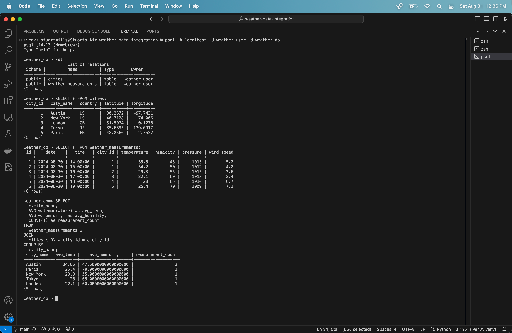
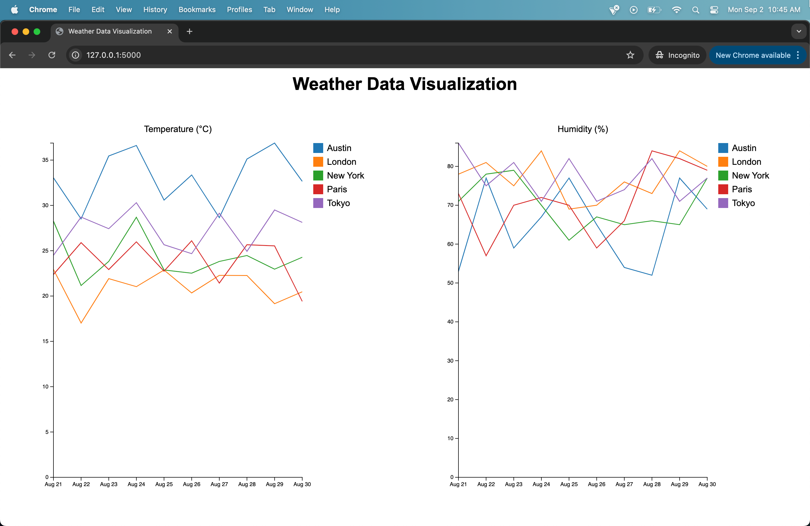

# Weather Data Integration Pipeline

This project integrates a third-party reporting tool (OpenWeatherMap API) with a data system. It includes an end-to-end ETL pipeline that extracts weather data, transforms it, and loads it into a PostgreSQL database.

## Project Overview

The Weather Data Integration Project demonstrates key data engineering skills by creating a pipeline that:

1. Extracts weather data from the OpenWeatherMap API
2. Transforms the raw data using Apache Spark to fit a designed star schema
3. Loads the processed data into a PostgreSQL database
4. Orchestrates the entire ETL process using Apache Airflow

## Data Model

The project uses a star schema with the following structure:

1. Fact Table: `weather_measurements`
   - id
   - date
   - time
   - city_id (foreign key to cities dimension)
   - temperature
   - humidity
   - pressure
   - wind_speed

2. Dimension Table: `cities`
   - city_id
   - city_name
   - country
   - latitude
   - longitude

## Database Result

## Data Visualization

## Technical Summary

This pipeline pulls weather data for five cities from the OpenWeatherMap API, transforms it with PySpark into a star schema (a weather measurements fact table and a cities dimension table), and loads it into PostgreSQL over JDBC. Apache Airflow runs the whole process daily. The code is split into separate modules for extraction, transformation, and loading, with logging and error handling throughout. Credentials and settings are kept in environment variables. A small Flask app uses SQLAlchemy and Pandas to query the database for visualization.
